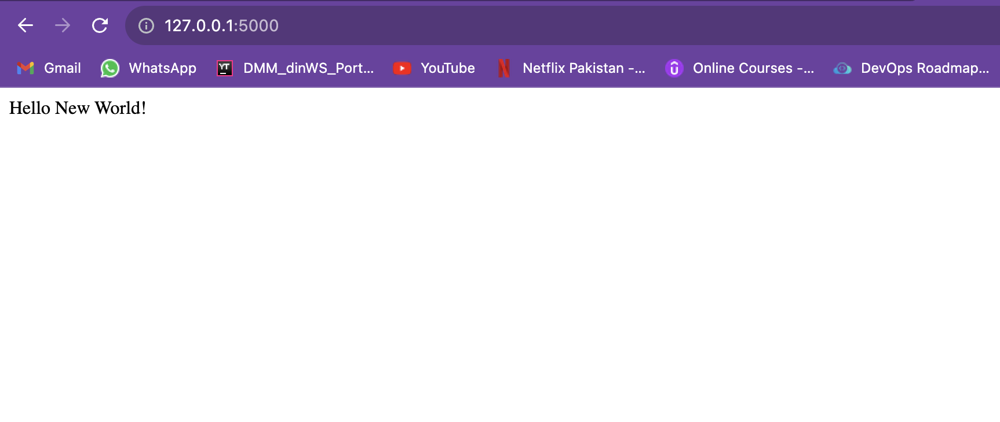

# Assignment -2

### a Docker file for the web application container which should include the necessary dependencies to run the web application. The web application should display a simple "Hello, World!"

### Docker file for the database container which should include the necessarydependencies to run the database. You can use any database of your choice (e.g.,MySQL, PostgreSQL, MongoDB, etc.).

### docker-compose.yml file that defines the two services - web and database. The web service should be linked to the database service using Docker Compose networking.

### Use the docker-compose up command to build and run the application. Verify that the web application is accessible from a web browser and that the database is running.

###  Docker file for the web application container to include a new feature (e.g., a new message, a new page, etc.). Rebuild the web application container and redeploy the application using docker-compose.

### Implement a backup strategy for the database. 

### Implement a scaling strategy for the web application

getting this error while scaling webapp

### ● Implement a monitoring strategy for the application.

unable to do it 